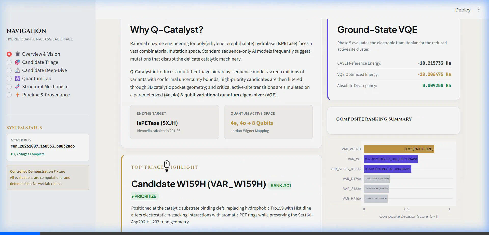
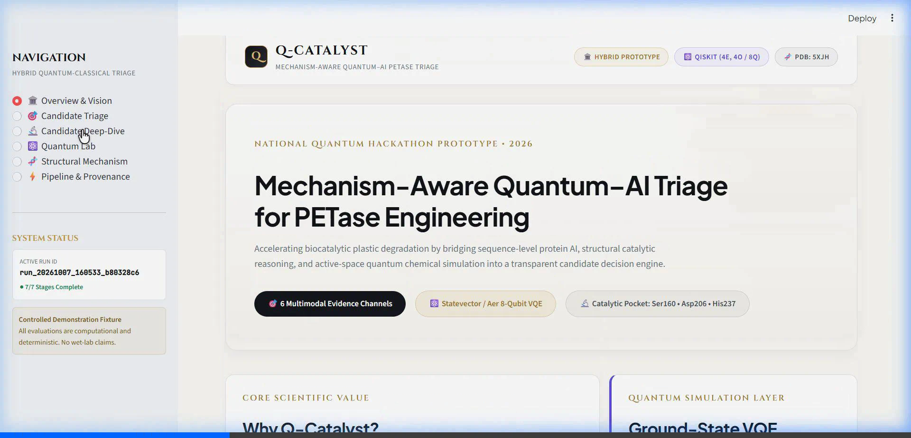
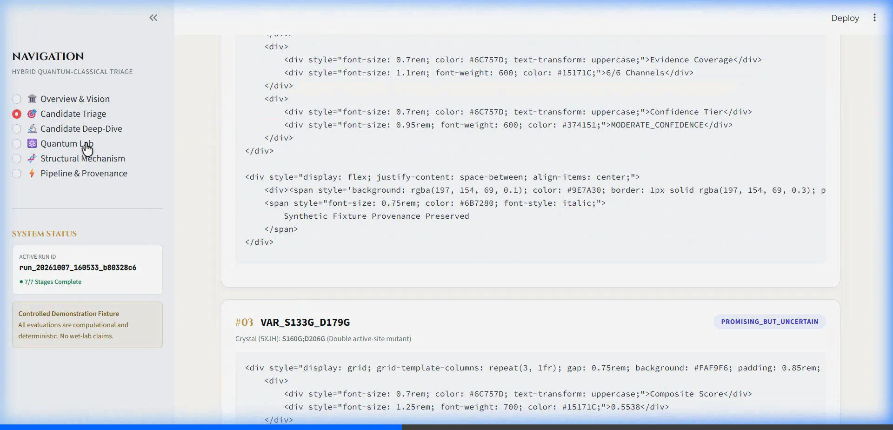
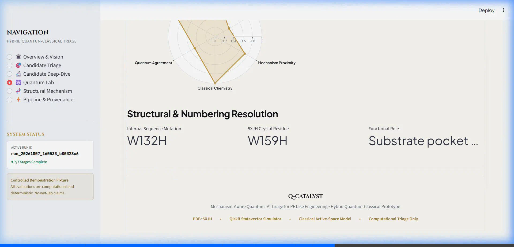
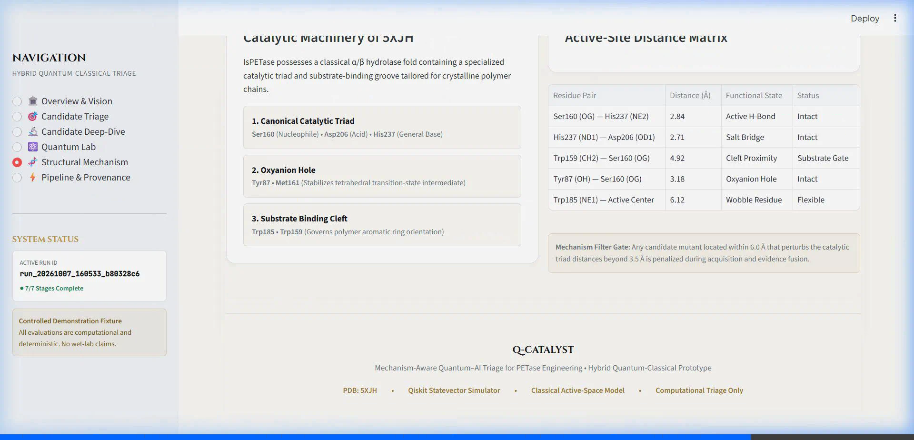
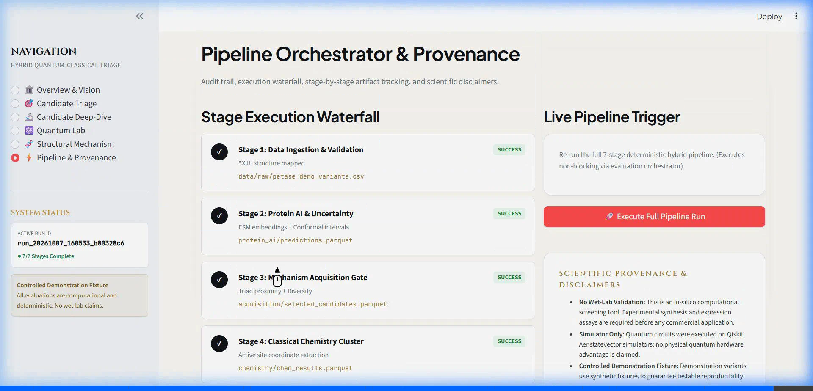

# Q-Catalyst: Mechanism-Aware Quantum–AI Triage for PETase Engineering

## Overview

**Q-Catalyst** is a modular computational framework designed to triage engineered enzyme variants (specifically polyethylene terephthalate hydrolases, or PETases) by combining sequence-based protein language representations with mechanism-aware quantum chemical simulation of transition states.

The overall architecture follows a strictly decoupled, modular pipeline:
$$\text{Data} \longrightarrow \text{Protein-AI} \longrightarrow \text{Uncertainty} \longrightarrow \text{Acquisition} \longrightarrow \text{Chemistry} \longrightarrow \text{Quantum} \longrightarrow \text{Fusion} \longrightarrow \text{Benchmark} \longrightarrow \text{App}$$

---

## Current Status: Phases 1, 2, 3, 4, 5, 6 & 7 Implemented (89/89 Tests Passing)

### Phase 1: Data Layer, Structure Foundation & Contracts (Verified)
- **Canonical Variant Data Layer**: Standardized tabular schema supporting single and multi-site mutants across enzyme scaffolds (*Is*PETase, LCC).
- **Mutation Engine**: Parser, normalizer, and sequence reconstructor supporting IUPAC 1-letter/3-letter point mutations and combinatorial sets (`S160A;D206G`).
- **Data Quality & Biological Validation**: Checks verifying amino acid validity, sequence integrity, physical boundaries (pH, crystallinity, $T_m$, activity), parent identifiers, and deduplication.
- **Leakage-Aware Splitting**: Partition engine implementing `study_grouped`, `parent_grouped`, `mutation_complexity`, and `random` splits.
- **Structural Mapping Foundation**: PDB parser and residue inspector keyed to reference *Is*PETase structure (PDB `5XJH`), verifying catalytic triad integrity (Ser160, Asp206, His237).
- **Inter-Module Contracts**: Central configuration and formal schemas registered for all pipeline stages.

### Phase 2: Protein AI, Multi-Component Uncertainty & Gate 0 (Verified)
- **ESM Representation & Zero-Shot Mutation Scoring**:
  - Masked marginal log-likelihood ratio calculation:
    $$\Delta \log P = \sum_{m \in \text{mutations}} [\log P(m.\text{to} \mid \text{context}) - \log P(m.\text{from} \mid \text{context})]$$
  - Fixed-dimensional mean-pooled sequence embeddings ($D = 320$ for ESM2-8M) with persistent disk caching (`protein_ai/cache/`).
  - CPU-compatible PyTorch/HuggingFace execution with offline deterministic fallback for isolated testing.
- **Lightweight Supervised Fitness Predictor**:
  - Task-specific regressor (Ridge, Gradient Boosting, Random Forest, XGBoost) trained strictly on training fold representations.
  - Predicts `activity_rel_to_parent` (or raw `activity_value`).
  - Modular artifact serialization to `artifacts/protein_ai/activity/`.
- **Multi-Component Uncertainty Estimation**:
  1. **Ensemble Disagreement**: Standard deviation $\sigma_{\text{ens}}(x)$ across $M=10$ bootstrap-trained predictor members.
  2. **Out-of-Distribution (OOD) Geometric Distance**: Normalized $k$-nearest-neighbor distance in embedding space from the training manifold.
  3. **Split Conformal Prediction**: Distribution-free prediction intervals $[\hat{y} - \hat{q}, \hat{y} + \hat{q}]$ calibrated on held-out validation residuals with finite-sample coverage guarantee ($1-\alpha = 90\%$).
  4. **Composite Uncertainty Score**:
     $$U(x) = w_1 \cdot \sigma_{\text{norm}}(x) + w_2 \cdot \text{OOD}_{\text{norm}}(x) + w_3 \cdot \text{Width}_{\text{norm}}(x)$$
- **Gate 0 Validation Assessment**:
  - Empirical verification determining whether uncertainty $U$ tracks absolute prediction error $|y_{\text{true}} - \hat{y}|$ on held-out test data.
  - Generates machine-readable `uncertainty/gate0_report.json` and human-readable `uncertainty/GATE0_REPORT.md`.

### Phase 3: Smart Acquisition Gate (Verified)
- **Multi-Objective Candidate Prioritization**:
  - Formulates acquisition priority combining predicted activity, model uncertainty, active-site geometric proximity, sequence diversity, and computational cost proxies:
    $$A_i = \alpha \cdot \hat{y}_{\text{norm}} + \beta \cdot U_{\text{norm}} + \gamma \cdot S_{\text{prox}} + \delta \cdot D_i - \lambda \cdot \text{Cost}_{\text{norm}}$$
- **Active-Site Structural Proximity**:
  - Maps point mutations against *Is*PETase PDB `5XJH` crystallographic coordinates.
  - Computes minimum Euclidean distance $d_{\min}$ to catalytic/binding pocket residues:
    - Catalytic Triad: Ser160, Asp206, His237
    - Oxyanion Hole: Tyr87, Met161
    - Substrate Pocket: Trp185, Trp159
  - Formulates smooth exponential proximity score: $S_{\text{prox}} = \exp\left(-\frac{d_{\min}}{d_0}\right)$ with $d_0 = 8.0 \text{ \AA}$.
- **Dynamic Sequence Diversity & Redundancy Penalization**:
  - Pairwise similarity matrix computed across candidate representations.
  - Greedy iterative selection: at each step $k$, updates candidate diversity $D(c_i, \mathcal{S}) = 1.0 - \max_{s \in \mathcal{S}} \text{Sim}(c_i, s)$ to ensure diverse candidate exploration.
- **Budget Enforcement & Natural Language Explanations**:
  - Strictly selects the configured candidate budget (default $K = 10$).
  - Produces structured, factual natural language selection rationale for every chosen candidate.

### Phase 4: Classical Chemistry Layer (Verified)
- **Reduced Catalytic Cluster Definition**:
  - Isolates the core reaction region from *Is*PETase PDB `5XJH`: Ser160, Asp206, His237, Tyr87, Met161, Trp185, Trp159.
  - Exports standard Cartesian coordinates (`.xyz`) and JSON metadata (`chemistry/active_site_report.json`).
- **Mutation-Aware Cluster Mapping & Geometry Provenance**:
  - Differentiates active-site mutations (`inside_cluster`, model-generated local geometry) from distal mutations (`outside_cluster`, unperturbed local active-site geometry).
  - Explicit provenance tagging: `geometry_source = "experimental_structure"` vs `"model_generated_from_5XJH"`.
- **Geometry Validation & Clash Detection**:
  - Screens molecular clusters for NaN/Inf coordinates, invalid atomic symbols, and severe steric clashes ($< 0.50\text{ \AA}$).
- **Classical Electronic Structure & Descriptors**:
  - Hartree-Fock baseline (`HF`) and optional DFT (`B3LYP`).
  - Explicit tracking of charge ($q = 0$), spin multiplicity ($2S+1 = 1$), and SCF convergence status (`scf_converged`, `scf_iterations`).
  - Extracts mechanistic descriptors: total energy ($E$), wild-type reference baseline ($E_{\text{ref}}$), relative energy difference ($\Delta E = E_{\text{variant}} - E_{\text{ref}}$), dipole moments ($\vec{\mu}$, $|\vec{\mu}|$), frontier orbital energies ($E_{\text{HOMO}}$, $E_{\text{LUMO}}$, HOMO-LUMO gap $\Delta \epsilon$), and catalytic triad distances (`Ser160-His237`, `His237-Asp206`).
- **Deterministic Calculation Caching**:
  - SHA-256 hashed computation keys based on `(cluster_id, geometry_hash, method, basis, charge, multiplicity)` to prevent redundant calculations.
- **Phase 5 Export Manifest**:
  - Machine-readable `chemistry/clusters/cluster_manifest.json` ensuring downstream quantum simulation knows the exact molecular cluster calculated in Phase 4.

### Phase 5: Quantum Simulation Layer (Verified)
- **Active-Space Formulation**:
  - Constructs $(4e, 4o)$ active space (4 active electrons in 4 frontier spatial orbitals $\implies 8$ spin-orbitals / qubits).
  - Validates particle capacity, spin multiplicity consistency, and integral shapes.
- **Fermionic Hamiltonian & Jordan-Wigner Qubit Mapping**:
  - Second-quantized electronic Hamiltonian mapped to an exact 8-qubit `SparsePauliOp` operator with a deterministic SHA-256 hash.
- **Exact Classical Reference (CASCI)**:
  - Exact matrix diagonalization in particle-conserving Fock subspace ($N_e = 4$) yielding $E_{\text{CASCI}} = -18.215733\text{ Ha}$.
- **Variational Quantum Eigensolver (VQE)**:
  - Parameterized `TwoLocal` ansatz ($R_y + CZ$, depth 7, 24 parameters) with Hartree-Fock state initialization $|11110000\rangle$.
  - Statevector energy expectation optimization using `COBYLA`, achieving $E_{\text{VQE}} = -18.206475\text{ Ha}$ with $\Delta E = 0.009258\text{ Ha}$ absolute error (EXCELLENT tier $<0.01\text{ Ha}$).
  - Full iteration-by-iteration optimization trajectory logged to `quantum/vqe_history.parquet`.
- **Simulated Quantum Noise**:
  - Evaluated under Qiskit Aer depolarizing noise model yielding $E_{\text{noisy}} = -18.142346\text{ Ha}$.

### Phase 6: Multimodal Evidence Fusion & Candidate Decision Engine (Verified)
- **6-Channel Evidence Normalization**:
  - Normalizes heterogeneous signals from Sequence AI, Prediction Uncertainty, Structural Proximity, Classical Chemistry, Quantum Agreement, and Sequence Diversity into standard $[0, 1]$ scales with full metadata provenance.
- **Transparent Composite Decision Scoring**:
  - $F_i = \sum w_k S_k$ with configurable weights strictly validated to sum to 1.0.
  - Dynamically renormalizes weights over available channels without penalizing uncomputed channels as zero.
- **Evidence Coverage & Decision Tiers**:
  - Calculates evidence coverage score $C_i = N_{\text{available}} / 6$.
  - Standardized triage categories: `PRIORITIZE`, `PROMISING_BUT_UNCERTAIN`, `INSUFFICIENT_EVIDENCE`, `LOW_PRIORITY`.
  - Confidence labeling (`HIGH_CONFIDENCE`, `MODERATE_CONFIDENCE`, `LOW_CONFIDENCE`) derived strictly from coverage and uncertainty.
- **Deterministic Explainability Engine**:
  - Generates rule-based summaries, positive/negative factor breakdowns, missing evidence lists, and explicit scientific limitations without LLM hallucination.
- **Artifact Serialization & CLI**:
  - Produces `fusion/fusion_results.parquet`, `fusion/evidence_matrix.parquet`, `fusion/fusion_manifest.json`, and `fusion/candidate_explanations.json`.
  - CLI runner: `python -m fusion.evaluate`.

### Phase 7: End-to-End Pipeline Orchestrator (Verified)
- **Unified 7-Stage Workflow**:
  - Seamless single-command execution chaining: Data $\to$ Protein AI $\to$ Uncertainty $\to$ Acquisition $\to$ Chemistry $\to$ Quantum $\to$ Fusion $\to$ Report.
- **Auditability & Execution Tracking**:
  - Generates `runs/<run_id>/manifest.json`, `pipeline_report.json`, `pipeline_report.md`, and `logs/pipeline.log`.
  - Rigorous timestamping, config hashing, seed logging, duration profiling, and artifact registration.
- **Resilient Caching & Failure Policies**:
  - Dynamic cache detection (`reuse_cached_outputs: true`, `SUCCESS_CACHED` status).
  - Hard failure on mandatory stages with `fail_fast: true`, non-fatal continuation on optional stages (`quantum`).
- **CLI Runner**:
  - `python -m pipeline.evaluate`.

---

## Implementation vs Availability Breakdown

| Pipeline Component | Status | Details |
| :--- | :--- | :--- |
| **Data Ingestion & Validation** | **IMPLEMENTED** | `data/build_dataset.py`, `data/validate.py` |
| **Leakage-Aware Splits** | **IMPLEMENTED** | `data/split.py` (`study_grouped`, `mutation_complexity`, `parent_grouped`) |
| **Structure 5XJH Foundation** | **AVAILABLE** | Reference PDB `5XJH` present at `data/structures/5xjh.pdb` |
| **PET-Gym Benchmark Data** | **NOT PRESENT LOCALLY** | Awaiting raw empirical files in `data/raw/` (no fabricated data) |
| **ESM Representation & Scoring** | **IMPLEMENTED** | `protein_ai/esm.py`, `protein_ai/embeddings.py`, `protein_ai/mutation_scoring.py` |
| **Supervised Predictors** | **IMPLEMENTED** | `protein_ai/predictors.py`, `protein_ai/features.py` |
| **Ensemble & OOD Uncertainty** | **IMPLEMENTED** | `uncertainty/ensemble.py`, `uncertainty/ood.py` |
| **Conformal Prediction** | **IMPLEMENTED** | `uncertainty/conformal.py` |
| **Gate 0 Empirical Assessment** | **IMPLEMENTED** | `uncertainty/gate0.py`, `uncertainty/evaluate.py` |
| **Smart Acquisition Gate** | **IMPLEMENTED** | `acquisition/selector.py`, `acquisition/proximity.py`, `acquisition/diversity.py`, `acquisition/evaluate.py` |
| **Classical Chemistry Layer** | **IMPLEMENTED** | `chemistry/cluster.py`, `chemistry/mutation.py`, `chemistry/electronic_structure.py`, `chemistry/evaluate.py` |
| **Quantum Simulation Layer** | **IMPLEMENTED** | `quantum/active_space.py`, `quantum/hamiltonian.py`, `quantum/casci.py`, `quantum/vqe.py`, `quantum/evaluate.py` |
| **Evidence Fusion & Decision Engine** | **IMPLEMENTED** | `fusion/evidence.py`, `fusion/scoring.py`, `fusion/ranker.py`, `fusion/evaluate.py` |
| **End-to-End Pipeline Orchestrator** | **IMPLEMENTED** | `pipeline/runner.py`, `pipeline/context.py`, `pipeline/manifest.py`, `pipeline/evaluate.py` |
| **Interactive Dashboard App** | *PHASE 8* | Streamlit jury-facing decision application |


---

## Repository Structure

```
qcatalyst/
│
├── data/
│   ├── raw/                  # Raw benchmark data directory (e.g. PET-Gym)
│   ├── curated/              # Destination for curated variants.parquet & quality reports
│   ├── structures/           # Reference PDB structures (5xjh.pdb)
│   ├── splits/               # Split manifests (study_grouped, mutation_complexity)
│   ├── schema.py             # Canonical schema and Record models
│   ├── mutations.py          # Robust mutation parser and sequence mutator
│   ├── validate.py           # Biological and physical dataset validator
│   ├── build_dataset.py      # Raw-to-curated ingestion pipeline
│   ├── split.py              # Leakage-aware splitting engine
│   ├── structure_utils.py    # PDB loader and active site residue mapper
│   └── contracts.py          # Machine-readable inter-module file contracts
│
├── protein_ai/
│   ├── config.py             # ESM, Predictor, and Uncertainty configuration schemas
│   ├── esm.py                # ESM wrapper (HuggingFace + deterministic fallback)
│   ├── embeddings.py         # Embedding extractor with disk cache
│   ├── mutation_scoring.py   # Zero-shot masked marginal log-likelihood scoring
│   ├── features.py           # Feature builder & StandardScaler pipeline
│   ├── predictors.py         # Lightweight supervised regression models
│   ├── outputs.py            # Output schema enforcer for predictions.parquet
│   ├── inference.py          # End-to-end inference workflow
│   ├── utils.py              # Metrics (Spearman, MAE, NDCG) & synthetic test fixtures
│   └── cache/                # Disk cache for embeddings and score matrices
│
├── uncertainty/
│   ├── ensemble.py           # Multi-model bootstrap ensemble disagreement
│   ├── ood.py                # k-NN geometric distance estimator
│   ├── conformal.py          # Split conformal prediction calibrator
│   ├── score.py              # Composite uncertainty scorer
│   ├── gate0.py              # Gate-0 correlation and error stratification analyzer
│   └── evaluate.py           # End-to-end uncertainty & Gate-0 CLI pipeline
│
├── acquisition/
│   ├── config.py             # Acquisition weights, budget, and proximity parameters
│   ├── proximity.py          # 3D active-site distance decay & structural mapping
│   ├── filters.py            # Quantile and threshold candidate filtering
│   ├── diversity.py          # Sequence/embedding similarity and greedy penalty
│   ├── scoring.py            # Multi-objective acquisition scoring & cost proxy
│   ├── selector.py           # Iterative greedy selector & explainability generator
│   ├── outputs.py            # Serialization to chem_jobs.json & selected_candidates.parquet
│   └── evaluate.py           # Acquisition CLI execution pipeline
│
├── chemistry/
│   ├── config.py             # Cluster and electronic structure configs
│   ├── structure.py          # PDB Chain A parser and coordinate extractor
│   ├── active_site.py        # Active-site locator and report generator
│   ├── cluster.py            # Reduced active-site cluster builder and XYZ exporter
│   ├── mutation.py           # Mutation-aware cluster modifier and provenance tracker
│   ├── geometry.py           # Geometry validator and steric clash detector
│   ├── electronic_structure.py # Classical HF/DFT electronic structure engine
│   ├── descriptors.py        # Mechanistic descriptor extractor and delta energy analyzer
│   ├── outputs.py            # Serialization to chem_results.parquet and cluster_manifest.json
│   ├── evaluate.py           # Chemistry CLI execution pipeline
│   ├── clusters/             # Output directory for WT/variant cluster XYZ and manifest files
│   └── README.md             # Chemistry methodology and scientific limitations
│
├── quantum/
│   ├── config.py             # Active space, VQE, and noise configs
│   ├── active_space.py       # (4e, 4o) active-space reduction and orbital validator
│   ├── hamiltonian.py        # Fermionic Hamiltonian builder and Jordan-Wigner 8-qubit mapper
│   ├── casci.py              # CASCI exact classical diagonalizer
│   ├── vqe.py                # Parameterized ansatz, state preparation, and VQE optimizer
│   ├── noise.py              # Qiskit Aer noise simulator
│   ├── outputs.py            # Serialization to quantum_results.parquet, vqe_history.parquet, manifests
│   ├── evaluate.py           # Quantum CLI execution pipeline
│   ├── hamiltonians/         # Saved JSON qubit Hamiltonian operators
│   └── README.md             # Quantum methodology, VQE convergence, and limitations
│
├── artifacts/
│   ├── protein_ai/activity/  # Serialized model weights (.joblib) & metadata (.json)
│   ├── chemistry/cache/      # Hashed calculation cache (.json)
│   └── quantum/cache/        # Hashed VQE calculation cache (.json)
│
├── tests/
│   ├── test_config.py
│   ├── test_contracts.py
│   ├── test_mutations.py
│   ├── test_schema.py
│   ├── test_split.py
│   ├── test_structure.py
│   ├── test_validation.py
│   ├── test_protein_ai.py
│   ├── test_uncertainty.py
│   ├── test_phase2_integration.py
│   ├── test_acquisition.py
│   ├── test_phase3_integration.py
│   ├── test_chemistry.py
│   ├── test_phase4_integration.py
│   ├── test_quantum.py
│   └── test_phase5_integration.py
│
├── configs/
│   ├── config.yaml
│   └── config_schema.py
├── scripts/
│   ├── download_structure.py
│   └── download_petgym.py
├── requirements.txt
├── pyproject.toml
└── README.md
```

---

## Output File Contracts

| Phase | Output Path | Required Columns / Keys |
| :--- | :--- | :--- |
| **Phase 1** | `data/curated/variants.parquet` | `variant_id`, `sequence`, `mutations`, `activity_rel_to_parent`, `data_quality_flag` |
| **Phase 2** | `protein_ai/predictions.parquet` | `variant_id`, `prediction`, `zero_shot_score`, `esm_log_likelihood_ratio`, `model_version` |
| **Phase 2** | `uncertainty/uncertainty.parquet` | `variant_id`, `prediction`, `ensemble_std`, `ood_score`, `conformal_lower`, `conformal_upper`, `uncertainty_score` |
| **Phase 2** | `uncertainty/gate0_report.json` | `dataset_name`, `split_strategy`, `spearman_correlation`, `useful_signal`, `recommendation` |
| **Phase 3** | `acquisition/chem_jobs.json` | `metadata` + candidates: `job_id`, `variant_id`, `mutations`, `active_site_residues`, `qm_method_requested`, `selection_rank` |
| **Phase 3** | `acquisition/selected_candidates.parquet` | `job_id`, `variant_id`, `mutations`, `predicted_performance`, `acquisition_score`, `selection_rank`, `selection_reason` |
| **Phase 4** | `chemistry/chem_results.parquet` | `variant_id`, `cluster_id`, `geometry_source`, `geometry_status`, `method`, `basis`, `scf_converged`, `total_energy`, `delta_energy`, `calculation_status` |
| **Phase 4** | `chemistry/clusters/cluster_manifest.json` | `version`, `cluster_count`, `clusters` |
| **Phase 4** | `chemistry/active_site_report.json` | `pdb_id`, `chain`, `residues_requested`, `residues_found`, `residues_missing`, `atom_count`, `mapping_status` |
| **Phase 5** | `quantum/quantum_results.parquet` | `variant_id`, `active_electrons`, `active_orbitals`, `initial_qubits`, `final_qubits`, `mapping_method`, `casci_energy`, `vqe_energy`, `vqe_absolute_error`, `optimizer`, `iterations`, `calculation_status` |
| **Phase 5** | `quantum/vqe_history.parquet` | `variant_id`, `iteration`, `energy`, `energy_error_vs_casci` |
| **Phase 5** | `quantum/quantum_manifest.json` | `version`, `variant_id`, `active_space`, `qubit_hamiltonian`, `casci_reference`, `vqe_results` |
| **Phase 5** | `quantum/active_space_manifest.json` | `variant_id`, `active_electrons`, `active_orbitals`, `num_spin_orbitals`, `orbital_indices` |

---

## Execution Guide

### 1. Run Complete Test Suite
```bash
pytest
```
*Executes all 76 unit and integration tests across data, structure, protein-AI, uncertainty, Gate-0, acquisition, classical chemistry, and quantum simulation modules.*

### 2. Run Protein-AI Inference Pipeline
```bash
python -m protein_ai.inference --variants data/curated/variants.parquet --split-strategy mutation_complexity
```

### 3. Run Uncertainty & Gate 0 Evaluation
```bash
python -m uncertainty.evaluate --variants data/curated/variants.parquet --split-strategy mutation_complexity
```

### 4. Run Smart Acquisition Gate
```bash
python -m acquisition.evaluate --predictions protein_ai/predictions.parquet --uncertainty uncertainty/uncertainty.parquet --budget 10
```

### 5. Run Classical Chemistry Layer
```bash
python -m chemistry.evaluate --input acquisition/selected_candidates.parquet --output chemistry/chem_results.parquet
```

### 6. Run Quantum Simulation Layer
```bash
python -m quantum.evaluate --chem-results chemistry/chem_results.parquet --noise
```

---

## Phase 8: Jury-Facing Interactive Application

The **Q-CATALYST** application provides an interactive, jury-grade demonstration platform for technical hackathon evaluation. Built with Streamlit, Plotly, and a custom luxury ivory/gold/silver design system, it makes every computational stage transparent and explorable.

### Launching the Application
```bash
streamlit run app/app.py --server.port=8501
```

### Application Views & Visual Proofs

| View 1: Overview & Vision | View 2: Candidate Triage |
| :---: | :---: |
|  |  |

| View 3: Candidate Deep-Dive | View 4: Quantum Lab |
| :---: | :---: |
|  |  |

| View 5: Structural Mechanism | View 6: Pipeline & Provenance |
| :---: | :---: |
|  |  |

### Key Features
1. **Dynamic Quantum Metrics**: Reads real $(4e, 4o)$ 8-qubit Hamiltonian values (61 Pauli terms), exact CASCI baseline ($-18.215733\text{ Ha}$), and TwoLocal VQE optimization trajectories directly from `quantum_manifest.json` and `vqe_history.parquet`.
2. **Residue Numbering Mapping**: Resolves mature 263-AA sequence positions ($W132H$, $S133A$, $D179A$, $H210A$) against crystallographic IsPETase 5XJH precursor coordinates ($W159H$, $S160A$, $D206A$, $H237A$).
3. **Transparent Evidence Fusion**: Interactive 6-axis Plotly radar chart displaying multimodal channel support with deterministic rule-based explainability.
4. **Prominent Provenance Flags**: Explicit synthetic fixture badges and clear notices that all evaluations are in-silico computational triage with simulator-based VQE.

---

## Scientific Scope & Methodological Disclaimers

> [!IMPORTANT]
> - **Classical Simulation of a Quantum Algorithm**: All quantum calculations are executed on a local classical statevector simulator (Qiskit / Aer). This does NOT represent physical quantum hardware execution.
> - **No Quantum Advantage Claimed**: The $(4e, 4o)$ simulation is an algorithmic validation experiment to demonstrate VQE convergence against the exact CASCI classical reference within the triage pipeline.
> - **Reduced Active-Site Cluster is a local mechanistic model, not the whole enzyme.** The cluster contains the immediate catalytic triad, oxyanion hole, and substrate cleft. It captures local electronic features and transition state geometry but does not simulate global protein dynamics or allosteric effects.
> - **Active-site proximity is a prioritization signal, not proof of functional importance.** Proximity to the catalytic triad or oxyanion hole identifies mutations situated within the primary reaction sphere; it does not constitute mechanistic proof of improved catalytic turnover.
> - **Gate-0 uncertainty usefulness is not considered empirically validated until PET-Gym evaluation is performed.** On unvalidated or synthetic splits, the acquisition gate automatically employs the `mechanism_aware_without_uncertainty` fallback policy.
> - **Estimated chemistry cost is an in-silico proxy.** The cost metric reflects mutational cluster complexity and mapping availability.
> - **No Overclaims**: Q-Catalyst produces prioritized candidates for downstream multimodal evidence fusion and laboratory testing. It does not experimentally prove enzyme kinetics or claim quantum advantage without physical experimental validation.


