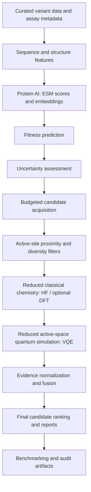

# Q-Catalyst

### Mechanism-Aware Quantum–AI Triage for PETase Engineering

**AI searches broadly. Uncertainty finds the blind spots. Classical and quantum chemistry investigate the candidates that matter.**

Q-Catalyst is a modular research prototype for prioritising PETase variants for further investigation. It combines protein-language-model representations, lightweight fitness prediction, uncertainty estimation, active-site-aware candidate selection, reduced classical electronic-structure calculations, a small active-space VQE simulation, and transparent evidence fusion.

The central research question is:

> **Can selectively allocated quantum-mechanical information improve AI-based prioritisation of uncertain PETase variants under a fixed computational budget?**

Q-Catalyst does **not** assume quantum advantage. It is designed to compare AI-only, structure-aware, classical-chemistry, and quantum-augmented approaches—and to report when extra chemistry does not justify its cost.

---

## Contents

- [Why Q-Catalyst?](#why-q-catalyst)
- [How it works](#how-it-works)
- [Technical pipeline](#technical-pipeline)
- [Quantum chemistry component](#quantum-chemistry-component)
- [Candidate scoring and evidence fusion](#candidate-scoring-and-evidence-fusion)
- [Current implementation status](#current-implementation-status)
- [Repository structure](#repository-structure)
- [Installation and usage](#installation-and-usage)
- [Outputs and reproducibility](#outputs-and-reproducibility)
- [Evaluation plan](#evaluation-plan)
- [Scientific limitations](#scientific-limitations)
- [Roadmap](#roadmap)
- [References and data sources](#references-and-data-sources)

## Why Q-Catalyst?

PETase enzymes can help break down polyethylene terephthalate (PET), a widely used plastic. Engineering improved enzymes requires exploring many possible sequence variants. Protein AI can screen sequences quickly, but predictions can be unreliable for novel or multi-mutation variants. Detailed chemical calculations can provide mechanistic information, but running them for every candidate is expensive.

Q-Catalyst treats mechanistic computation as a limited resource:

1. **Search broadly:** use protein AI to score candidate variants.
2. **Estimate uncertainty:** combine ensemble disagreement, distance from the training distribution, and prediction intervals.
3. **Select selectively:** prioritise candidates using predicted performance, uncertainty, active-site proximity, diversity, and estimated cost.
4. **Inspect chemistry:** calculate descriptors for a reduced catalytic region rather than the whole protein.
5. **Test the quantum contribution:** run a small active-space quantum-algorithm simulation with an exact classical reference.
6. **Fuse evidence:** re-rank candidates while showing available evidence, uncertainty, and missing information.
7. **Benchmark fairly:** compare strategies under matched computational budgets.

The intended output is an **experimentally testable candidate shortlist**, not a guarantee of improved PET degradation or experimentally validated enzyme performance.

## How it works



Only candidates that pass the configured eligibility and budget gates should be sent to expensive mechanistic calculations. A mutation far from the selected active-site cluster cannot be fully explained by that local cluster; this is a known modelling boundary, not something the score should hide.

## Technical pipeline

### 1. Data layer and biological validation

- Canonical schema for single- and multi-site variants across supported enzyme scaffolds.
- Mutation parsing, normalization, and sequence reconstruction for one-letter and three-letter amino-acid notation.
- Validation of amino-acid identities, sequence integrity, parent identifiers, duplicates, and plausible assay fields.
- Assay metadata preservation, including temperature, pH, substrate, PET crystallinity, enzyme loading, reaction time, and measurement method where available.
- Leakage-aware split strategies such as study-grouped, parent-grouped, and mutation-complexity splits.
- Structural reference support for IsPETase PDB **5XJH**, including catalytic-triad residue inspection (Ser160, Asp206, His237).

Measurements from different studies should not be merged as if they were directly comparable. Raw values and their assay context should be retained alongside any normalized targets.

### 2. Protein AI and fitness prediction

- **ESM-1v:** zero-shot mutation-effect scoring using masked marginal log-likelihood differences.
- **ESM-2:** fixed-dimensional sequence embeddings, with caching to avoid repeated inference.
- **Lightweight supervised models:** Ridge regression, Gradient Boosting, Random Forest, or XGBoost, depending on configuration and data availability.
- **Prediction targets:** relative activity or recorded activity values; thermal stability (`T_m`) can be added when there is sufficient compatible data.
- **Training discipline:** fit learned transformations and predictors on training folds only; use grouped evaluation to reduce sequence/study leakage.

A protein-language-model score is not an experimental PET-degradation measurement. Its role is to provide a scalable screening signal.

### 3. Multi-component uncertainty

The uncertainty module combines complementary signals rather than treating one model score as certainty:

- **Ensemble disagreement:** variation across bootstrap-trained predictors.
- **Out-of-distribution (OOD) distance:** k-nearest-neighbour distance in embedding space relative to training examples.
- **Conformal intervals:** prediction intervals calibrated on held-out validation residuals, when the data and assumptions support their use.
- **Composite uncertainty:** configurable combination of normalized signals.
- **Gate 0 assessment:** evaluates whether uncertainty is associated with absolute prediction error on held-out data.

The selector should not assume uncertainty is useful just because a score can be computed. If Gate 0 shows that uncertainty does not track error, the system should report the limitation and use an explicitly documented fallback, such as diversity-based selection.

### 4. Budgeted candidate acquisition

Candidate selection combines:

- predicted performance;
- model uncertainty;
- proximity to catalytic or substrate-binding residues;
- sequence/embedding diversity to reduce redundant picks; and
- estimated chemistry cost.

A representative configurable acquisition function is:

\[
A_i = \alpha \hat{y}_{i,\mathrm{norm}} + \beta U_{i,\mathrm{norm}} + \gamma S_{i,\mathrm{prox}} + \delta D_i - \lambda C_{i,\mathrm{norm}}
\]

where \(\hat y_i\) is predicted fitness, \(U_i\) is uncertainty, \(S_{i,\mathrm{prox}}\) is active-site proximity, \(D_i\) is diversity, and \(C_i\) is estimated cost. Weights and thresholds are configuration choices and should be tuned only on training/validation data—not the final held-out test set.

For the IsPETase 5XJH reference, the current proximity foundation considers catalytic-triad residues Ser160, Asp206, and His237, plus selected oxyanion-hole and substrate-pocket residues. Proximity is a screening heuristic; it does not prove a mutation affects catalysis.

### 5. Reduced classical chemistry

Q-Catalyst does not run electronic-structure calculations on the full PETase protein. It builds a reduced active-site cluster around selected catalytic and binding residues, then validates the geometry before calculation.

The chemistry layer includes:

- extraction/export of cluster coordinates and metadata;
- mutation-aware geometry handling and provenance labels;
- checks for invalid coordinates, atoms, and severe steric clashes;
- Hartree–Fock (HF) calculations and optional density-functional theory (DFT, such as B3LYP), subject to configuration and runtime;
- total and relative energies, dipole moments, frontier orbital energies, HOMO–LUMO gap, and selected catalytic-residue distances; and
- deterministic caching keyed by cluster geometry and calculation settings.

These descriptors depend on the chosen cluster, geometry, charge, spin, method, and basis. They are approximations to local electronic structure—not direct predictions of PET degradation rate or complete enzyme dynamics.

## Quantum chemistry component

### Reduced active-space workflow

The quantum module is deliberately small and is a **classically simulated proof of concept**, not a claim of execution on physical quantum hardware.

1. **Active-space definition:** select a small set of frontier orbitals and the corresponding active electrons from the reduced chemical model.
2. **Fermionic Hamiltonian:** construct the electronic Hamiltonian in second-quantized form.
3. **Qubit mapping:** map fermionic operators to qubit operators using the Jordan–Wigner transformation.
4. **Exact classical control:** compute a CASCI (complete active-space configuration interaction) reference in the same active space where feasible.
5. **VQE simulation:** use a parameterized quantum circuit and classical optimizer to minimize the Hamiltonian expectation value.
6. **Noise sensitivity:** optionally evaluate a simulated noise model and compare its effect with the noiseless result.
7. **Report the boundary:** record energy error, convergence, circuit depth, qubit count, and runtime; do not automatically treat VQE output as a better candidate score.

### Current prototype configuration

The existing project notes report the following prototype setup; these values describe a reduced model and **must not be interpreted as whole-enzyme energies or experimental outcomes**:

| Component | Prototype configuration / reported output |
|---|---|
| Active space | 4 active electrons in 4 spatial orbitals (8 spin orbitals / 8 qubits) |
| Qubit mapping | Jordan–Wigner; Qiskit `SparsePauliOp` representation |
| Classical reference | CASCI exact diagonalization in the selected active space |
| VQE ansatz | `TwoLocal` with `RY` rotations and `CZ` entanglers; depth 7, 24 parameters |
| Initialization / optimizer | Hartree–Fock reference state; COBYLA optimizer |
| Reported noiseless VQE energy | −18.206475 Ha |
| Reported CASCI reference energy | −18.215733 Ha |
| Absolute reported difference | 0.009258 Ha (9.258 mHa) |
| Simulated noisy energy | −18.142346 Ha under a depolarizing-noise model |

These are implementation-reported outputs, not independently reproduced results in this README. The reported VQE–CASCI difference is approximately **9.26 mHa**, larger than the commonly cited chemical-accuracy scale of about **1.6 mHa**; it should therefore be described quantitatively rather than simply labelled chemically accurate. Energies are meaningful only with their Hamiltonian, basis, active-space definition, and reference conventions documented.

### Why compare VQE with CASCI?

A quantum algorithm should not receive credit merely because it is included in the pipeline. CASCI provides an exact classical reference for the same finite active-space problem. In an ideal noiseless setting, VQE is expected to approach that reference, subject to ansatz expressivity and optimization. This control distinguishes the information contained in the chosen active space from any benefit attributable to the VQE procedure itself.

Q-Catalyst therefore separates two questions:

- **Does selected chemical information improve candidate prioritization?** Compare the ranking with and without the chemical descriptors.
- **Does VQE add value beyond an exact classical solution of the same reduced model?** Compare VQE with CASCI, including error and computational cost.

For small active spaces, exact classical diagonalization may be more accurate and simpler. That is a useful boundary result, not a failure of the project. The project makes no claim of quantum speedup or quantum advantage.

## Candidate scoring and evidence fusion

The fusion layer normalizes the evidence channels and produces an interpretable decision record. The current six channels are:

1. sequence-AI evidence;
2. prediction uncertainty;
3. structural proximity;
4. classical chemistry;
5. quantum agreement/evidence; and
6. sequence diversity.

A configurable weighted score is calculated from available channels. Weights are renormalized over evidence that is actually present, rather than treating an uncomputed channel as a zero. Each candidate also receives an evidence-coverage value and a decision tier, such as:

- `PRIORITIZE`
- `PROMISING_BUT_UNCERTAIN`
- `INSUFFICIENT_EVIDENCE`
- `LOW_PRIORITY`

Confidence labels are based on evidence coverage and uncertainty, not on the rank alone. Rule-based explanations identify positive and negative factors, missing evidence, and relevant limitations. Candidate outputs should be labelled **computationally prioritised / experimentally testable**, never experimentally validated unless wet-lab validation has actually occurred.

## Current implementation status

The supplied repository README reports **Phases 1–7 implemented and 89/89 tests passing** at the time it was written. This is a repository-reported status and may change as the code evolves.

| Component | Status reported in existing project notes | Main entry points |
|---|---|---|
| Data ingestion, schema, validation | Implemented | `data/build_dataset.py`, `data/validate.py` |
| Leakage-aware data splitting | Implemented | `data/split.py` |
| IsPETase 5XJH structure foundation | Available locally | `data/structures/5xjh.pdb` |
| ESM scoring and embeddings | Implemented | `protein_ai/esm.py`, `protein_ai/embeddings.py`, `protein_ai/mutation_scoring.py` |
| Supervised predictors and features | Implemented | `protein_ai/predictors.py`, `protein_ai/features.py` |
| Ensemble, OOD, conformal uncertainty | Implemented | `uncertainty/ensemble.py`, `uncertainty/ood.py`, `uncertainty/conformal.py` |
| Gate 0 uncertainty assessment | Implemented | `uncertainty/gate0.py`, `uncertainty/evaluate.py` |
| Candidate acquisition and proximity | Implemented | `acquisition/selector.py`, `acquisition/proximity.py`, `acquisition/diversity.py` |
| Classical chemistry | Implemented | `chemistry/cluster.py`, `chemistry/mutation.py`, `chemistry/electronic_structure.py` |
| Reduced quantum simulation | Implemented | `quantum/active_space.py`, `quantum/hamiltonian.py`, `quantum/casci.py`, `quantum/vqe.py` |
| Evidence fusion and ranking | Implemented | `fusion/evidence.py`, `fusion/scoring.py`, `fusion/ranker.py` |
| End-to-end pipeline orchestration | Implemented | `pipeline/runner.py`, `pipeline/context.py`, `pipeline/manifest.py` |
| PET-Gym empirical benchmark files | **Not present locally** in the supplied status notes | Expected under `data/raw/` |
| Interactive Streamlit jury dashboard | Phase 8 / planned in the supplied status notes | Verify current branch before use |

Please check the current branch and run the test suite before treating any status above as current. In particular, code paths and generated artifacts can exist even when the empirical benchmark files needed for a meaningful evaluation are not present.

## Repository structure

```text
qcatalyst/
├── data/
│   ├── raw/                  # Source benchmark files (not assumed to be present)
│   ├── curated/              # Curated variants and quality reports
│   ├── structures/           # Reference structures, including 5xjh.pdb
│   ├── splits/               # Split manifests
│   ├── schema.py             # Canonical data schema
│   ├── mutations.py          # Mutation parsing and sequence reconstruction
│   ├── validate.py           # Data and biological validation
│   ├── build_dataset.py      # Dataset ingestion
│   ├── split.py              # Leakage-aware split generation
│   └── structure_utils.py    # Structure/residue utilities
├── protein_ai/               # ESM, embeddings, mutation scoring, predictors
├── uncertainty/              # Ensemble, OOD, conformal intervals, Gate 0
├── acquisition/              # Proximity, diversity, budgeted candidate selection
├── chemistry/                # Reduced clusters, geometry, HF/DFT descriptors
├── quantum/                  # Active space, Hamiltonian, CASCI, VQE
├── fusion/                   # Evidence normalization, ranking, explanations
├── pipeline/                 # Orchestration, manifests, reporting
├── artifacts/                # Model and pipeline artifacts (generated)
├── runs/                     # Run-specific manifests, reports, and logs
└── README.md
```

Some directories and artifacts are generated at runtime and may not be committed to version control. Confirm the actual repository tree for your branch.

## Installation and usage

The precise dependencies and optional chemistry/quantum backends are environment-dependent. Use the project's pinned dependency file if available and install into an isolated environment.

```bash
# Clone the repository and enter its root
 git clone <YOUR_REPOSITORY_URL>
 cd qcatalyst

# Create and activate a virtual environment (Windows PowerShell)
 python -m venv .venv
 .\.venv\Scripts\Activate.ps1

# Or on macOS/Linux
 # python -m venv .venv
 # source .venv/bin/activate

# Install the repository's dependency file if present
 pip install -r requirements.txt
```

The commands below are the CLI entry points documented by the project. Run them from the repository root after confirming the required data, configuration, dependencies, and output directories are available:

```bash
# Run the end-to-end pipeline
python -m pipeline.evaluate

# Run an individual module as needed
python -m uncertainty.evaluate
python -m acquisition.evaluate
python -m chemistry.evaluate
python -m quantum.evaluate
python -m fusion.evaluate
```

If your current checkout uses different command-line arguments or configuration files, follow the module help and repository configuration. ESM inference may require model weights to be downloaded or available in the local Hugging Face cache; offline fallback behaviour is intended for deterministic testing and must not be mistaken for real model inference.

## Outputs and reproducibility

The pipeline is designed to write structured outputs such as:

- curated variant tables and data-quality reports;
- prediction and uncertainty tables;
- candidate-selection and chemistry-job manifests;
- active-site cluster coordinates and cluster manifests;
- classical-chemistry and quantum result tables;
- evidence matrices, final rankings, and candidate explanations;
- `runs/<run_id>/manifest.json`;
- `pipeline_report.json` and `pipeline_report.md`; and
- pipeline logs and timing information.

Run manifests are intended to record configuration hashes, seeds, timestamps, stage status, durations, and artifact references. Use the generated manifests to trace a result back to its input data and settings. Cached outputs should be clearly marked so that a cached result is not confused with a fresh calculation.

## Evaluation plan

The research question must be tested with controlled comparisons rather than a single final score. The intended benchmark arms are:

| Arm | Information used | What it tests |
|---|---|---|
| A0 | Random ranking | Baseline / floor |
| A1 | ESM-1v zero-shot score | Sequence-model baseline |
| A2 | Supervised AI plus structural features | Strong non-chemistry baseline |
| A3 | A2 plus classical chemistry for randomly selected eligible variants | Value of chemistry without uncertainty-guided allocation |
| A4 | A2 plus classical chemistry for uncertainty-gated eligible variants | Whether selective allocation helps under the same budget |
| A5 | A4 plus exact CASCI descriptors for a subset | Value of active-space correlation information |
| A6 | A4 plus VQE descriptors for the same subset | VQE versus exact classical reference |
| A7 | A4 plus noisy VQE descriptors | Sensitivity to a simulated noise model |

Recommended metrics include Precision@5/10/20, enrichment over random selection, NDCG@K, Spearman or Kendall rank correlation, number of chemistry evaluations avoided, and **value of chemistry** (ranking improvement per chemistry CPU-hour). For VQE, report energy error relative to CASCI, qubit count, circuit depth, gate count where available, iterations, runtime, and noise sensitivity.

Use study-/parent-/sequence-aware splits, paired comparisons on the same held-out examples, repeated runs where practical, and uncertainty intervals around metric differences. If there are too few eligible measured variants, describe the result as pilot-scale evidence. Do not tune on the final test set or report random-split-only gains as strong evidence when related sequences leak across splits.

## Scientific limitations

- **No wet-lab validation is implied.** Computational ranks are hypotheses for experiments, not measured degradation outcomes.
- **Dataset coverage is a bottleneck.** PETase datasets are small and assay conditions vary. The empirical benchmark files were reported as absent locally in the supplied status notes.
- **Local clusters are incomplete models.** They cannot fully represent distal mutations, long-range electrostatics, protein dynamics, solvent effects, or PET-surface heterogeneity.
- **VQE is currently simulated.** A statevector or noise-model simulation is not execution on a quantum processor and does not establish quantum advantage.
- **Small active spaces favour classical controls.** CASCI may be exact for the selected reduced problem; VQE can have nonzero variational/optimization error.
- **Quantum features may not improve ranking.** A null or negative result is scientifically useful and should be reported.
- **Uncertainty must be validated.** Ensemble disagreement or OOD distance is not automatically calibrated confidence.
- **Patent flags are not legal advice.** Similarity and prior-art indicators do not establish patentability or freedom to operate.

## Roadmap

- [x] Canonical data schema, mutation parsing, validation, and structure foundation
- [x] Protein-AI scoring and embedding/predictor interfaces
- [x] Multi-component uncertainty and Gate 0 evaluation
- [x] Budgeted candidate acquisition with proximity/diversity signals
- [x] Reduced classical chemistry interface
- [x] Reduced active-space CASCI/VQE simulation path
- [x] Evidence fusion, ranking, explanations, and pipeline orchestration
- [ ] Add/verify public empirical PETase benchmark files and assay-quality metadata
- [ ] Run and publish grouped-split fixed-budget ablation results
- [ ] Validate whether chemistry-selection uncertainty predicts held-out error
- [ ] Complete and verify the interactive dashboard against real pipeline artifacts
- [ ] Optional: implement a genuine additional active-learning iteration
- [ ] Optional: evaluate quantum noise and additional reduced active spaces

## References and data sources

Use primary sources and record the exact version, licence, retrieval date, and processing steps for every dataset/model used in a reproducible run. Relevant source categories include:

- **Protein structures:** [RCSB Protein Data Bank](https://www.rcsb.org/), including IsPETase structure 5XJH.
- **Protein sequences and annotations:** [UniProt](https://www.uniprot.org/).
- **Protein language models:** [ESM / Evolutionary Scale Modeling](https://github.com/facebookresearch/esm) and [Hugging Face](https://huggingface.co/).
- **Quantum chemistry:** [PySCF](https://pyscf.org/), [Qiskit](https://www.ibm.com/quantum/qiskit), [Qiskit Nature](https://qiskit-community.github.io/qiskit-nature/), and [Qiskit Aer](https://qiskit.github.io/qiskit-aer/).
- **General mutation-effect benchmarking:** [ProteinGym](https://proteingym.org/) (a general protein benchmark, not a PETase-specific dataset).
- **PETase-specific empirical datasets:** verify the availability, licence, and version of PET-Gym or other published variant tables before claiming a benchmark has been run.
- **Patent prior art:** [WIPO PATENTSCOPE](https://patentscope.wipo.int/), [Google Patents](https://patents.google.com/), and [Espacenet](https://worldwide.espacenet.com/).

Cite the original publications for specific biological claims and methods in project reports. Dataset and model availability, package APIs, and literature status can change; verify them before a submission.

---

## Project positioning

> **Q-Catalyst does not use quantum computing to search the entire protein universe. It uses mechanistic computation selectively—where AI is uncertain and local chemistry may matter—and measures whether that information is worth its computational cost.**

The project’s contribution is the **uncertainty-aware allocation and controlled evaluation of mechanistic computation**, not the invention of protein language models, PETase engineering, DFT, VQE, or quantum protein design.
